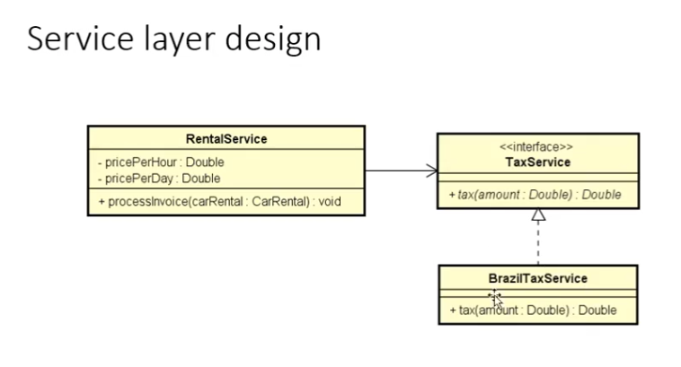
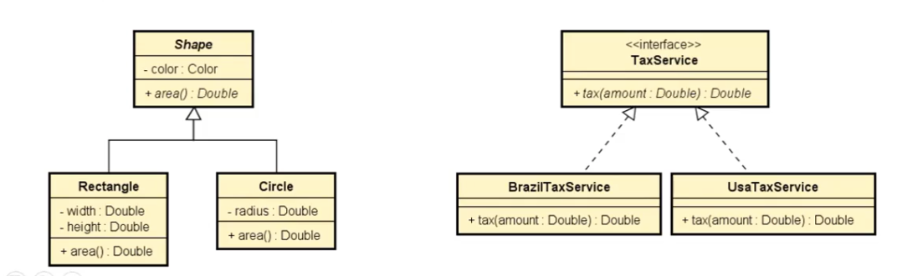
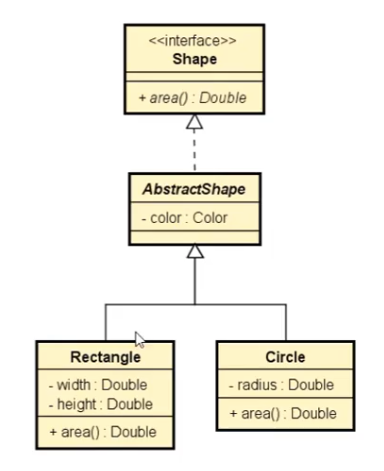
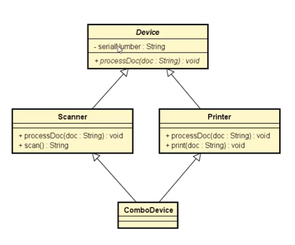
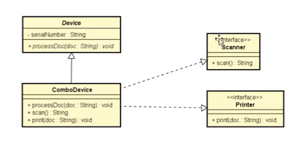

# Class notes

## 11. Intefaces

## Exercício da locadora de carros

### Camada de domínio (Entidades do negócio)

CarRental está associada as classes Vehicle, que trás os dados do carro, e Invoice, que tem os detalhes referentes a nota de pagamento.

- **CarRental**

  - start: Date

  - end: Date

    - **Vehicle**
      - Modelo: String
    - **Invoice**
      - basicPayment: Double
      - tax: Double
      - / totalPayment: Double

### Camada de Serviços

Servicços que realizam as operações, que estão associadas ao negócio.

O serviço de aluguel é responsável pela lógica da nota de pagamento. Porém a lógica do imposto está sendo delegada para um serviço de imposto. Caracterizando uma composição de serviços.

- **RentalService**
  - pricePerHour: Double
  - pricePerDay: Double
  - processInvoice(carRental: CarRental) : void
  - **BrazilTaxService**
    - tax(amount: Double): Double

### Implementando a solução - SEM interface

Primeiramente, foram criadas as entidades:

- Vehicle, com a propriedade *Model*.

  ```csharp
  namespace Course.Entities
  {
      class Vehicle
      {
          public string Model { get; set; }

          public Vehicle(string model)
          {
              Model = model;
          }
      }
  }
  ```

- Invoice, com as propriedades _BasicPayment_, _Tax_ e a propriedade calculada _TotalPayment_ .

  ```csharp
  using System.Globalization;
  namespace Course.Entities
  {
      class Invoice
      {
          public double BasicPayment { get; set; }
          public double Tax { get; set; }

          public Invoice(double basicPayment, double tax)
          {
              BasicPayment = basicPayment;
              Tax = tax;
          }

          public double TotalPayment {
              get { return BasicPayment + Tax; }
          }

          public override string ToString()
          {
              return "Basic Payment: "
              + BasicPayment.ToString("F2", CultureInfo.InvariantCulture)
              + "\nTax: "
              + Tax.ToString("F2", CultureInfo.InvariantCulture)
              + "\nTotal payment: "
              + TotalPayment.ToString("F2", CultureInfo.InvariantCulture);
          }
      }
  }
  ```

- CarRental, com as propriedades _Start_, _End_, _Vehicle_ e _Invoice_ . A propriedade invoice não foi incluida no construtor, pois ela receberá seu valor a partir do serviço _RentalService_.

  ```csharp
  namespace Course.Entities
  {
      public class CarRental
      {

          public DateTime Start { get; set; }
          public DateTime Finish { get; set; }
          public Vehicle Vehicle { get; set; }
          public Invoice Invoice { get; set; }

          public CarRental ( DateTime start, DateTime finish, Vehicle vehicle )
          {
              Start = start;
              Finish = finish;
              Vehicle = vehicle;
          }

      }
  }
  ```

Depois, foram criados os serviços:

- **BrazilTaxService** : contém a lógica de cálculo de imposto, de acordo com o valor da nota.

  ```csharp
  //BrazilTaxService
  class BrazilTaxService
  {
      public double Tax(double amount)
      {
          if (amount <= 100)
          {
              return amount * 0.2;
          }
          else
          {
              return amount * 0.15;
          }

      }
  }
  ```

- **RentalService** : responsável por processar o aluguel, e gerar a nota de pagamento (Invoice).

  ```csharp
  using Course.Entities;

  namespace Course.Services
  {
      class RentalService
      {
          public double PricePerHour { get; private set; }
          public double PricePerDay { get; private set; }

          public RentalService(double pricePerHour, double pricePerDay)
          {
              PricePerHour = pricePerHour;
              PricePerDay = pricePerDay;
          }

          public void ProcessInvoice(CarRental carRental)
          {

          }

      }
  }
  ```

- O método responsável por gerar o Invoice, _ProcessInvoice_ precisa do valor das taxas, para gerar o mesmo. Logo, será necessário estabelecer uma dependência entre o serviço em questão, e o serviço responsável pelo cálculo das taxas (BrazilTaxService).

  - Para tal será criada uma dependência do RentalService para o BrazilTaxService.

    Dentro da classe (serviço) RentalService, cria-se um atributo privado, o qual receberá uma instância do objeto BrazilTaxService:

    ```csharp
    private BrazilTaxService _brazilTaxService = new BrazilTaxService();
    ```

  - Em seguida, é feita a implementação do método _ProcessInvoice_ , que possui as regras de negócio necessárias para calcular a o valor total da locação, considerando os impostos, e com essas informações gerar o Invoice.

    ```csharp
    public void ProcessInvoice(CarRental carRental)
    {
     TimeSpan duration = carRenta.Finish.Subtract(carRental.Start);

        double basicPayment = 0.0;
        if (duration.TotalHours <= 12)
        {
            basicPayment = PricePerHour * Math.Ceiling(duration.TotalHours);
        }
        else
        {
            basicPayment = PricePerDay * Math.Ceiling(duration.TotalDays);
        }

        double tax = _brazilTaxService.Tax(basicPayment);

        carRental.Invoice = new Invoice(basicPayment, tax);
    }
    ```

    A estrutura completa do serviço ficou da seguinte forma:

    ```csharp
    //Rental Service
    using Course.Entities;

    namespace Course.Services
    {
        class RentalService
        {
            public double PricePerHour { get; private set; }
            public double PricePerDay { get; private set; }

            private BrazilTaxService _brazilTaxService = new BrazilTaxService();

            public RentalService(double pricePerHour, double pricePerDay)
            {
                PricePerHour = pricePerHour;
                PricePerDay = pricePerDay;
            }

            public void ProcessInvoice(CarRental carRental)
            {
                TimeSpan duration = carRental.Finish.Subtract(carRental.Start);

                double basicPayment = 0.0;

                if (duration.TotalHours <= 12.0)
                {
                    basicPayment = PricePerHour * Math.Ceiling(duration.TotalHours);
                }
                else
                {
                    basicPayment = PricePerDay * Math.Ceiling(duration.TotalDays);
                }

                double tax = _brazilTaxService.Tax(basicPayment);

                carRental.Invoice = new Invoice(basicPayment, tax);
            }

        }
    }
    ```

    - No programa principal, após serem recebidos todos os dados do usário, e ter sido instanciado um objeto do tipo _carRental_, será instanciado o serviço _RentalService_ para que o aluguel possa ser processado.

      ```csharp
      //Importanto o novo serviço
      using Course.Services;

      //(...) corpo do programa, no qual é feita a colheta de dados fornecidos pelo usuário

      //Instanciando um novo Aluguel
      CarRental carRental = new CarRental(start, finish, new Vehicle(model));

      //Instanciando um novo serviço de aluguel
      RentalService rentalService = new RentalService(hour, day);

      //Gerando o objeto Invoice
      rentalService.ProcessInvoice(carRental);

      //Por fim, é feita a impressão do Invoice
      Console.WriteLine("INVOICE: ");
      Console.WriteLine(carRental.Invoice);
      ```

      ### Implementando solução - COM INTERFACE

      ​ Como foi feita uma dependência direta do serviço de aluguel para o serviço de imposto, eles ficam fortemente acoplados. Ou seja, caso seja necessário trocar o serviço de imposto, também será necessário modificar a implementação do serviço dentro da classe RentalService.

      ​ O ideal é que se possa alterar as dependências da classe, sem ter de modificar a classe em sí.

      ​ Para resolver esse problema, o serviço RentalService passará a ter dependência para uma interface genérica TaxService, que tem uma operação chamada Tax. A interface define o contrato que o serviço de imposto deve cumprir. Nesse caso o contrato estabelece que o serviço de imposto deve implementar uma operação Tax, que recebe uma quantia, e retornando o valor do imposto.

      

      - Será criado o arquivo de interface _ITaxService_ dentro da pasta Services.

        ```csharp
        //ITaxService.cs

        namespace Course.Services
        {
            interface ITaxService
            {
                double Tax(double amount);
            }
        }
        ```

      - No _RentalService_ a dependência pelo serviço _BrazilTaxService_ será substituída pela dependência da interface _ITaxService_.

      - A instanciação não será mais feita no momento em que se declara a dependência. Ao invés disso, o construtor será modificado, para que receba mais um atributo, que é referente ao serviço de impostos. Isso é chamado de **Inversão de controle, por meio de inversão de dependência.**. A classe RentalService não é mais responsável por instanciar sua própria dependência.

        ```csharp
        //Rental Service
        using Course.Entities;

        namespace Course.Services
        {
            class RentalService
            {
                public double PricePerHour { get; private set; }
                public double PricePerDay { get; private set; }

                private ITaxService _taxService;

                public RentalService(double pricePerHour, double pricePerDay, ITaxService taxService)
                {
                    PricePerHour = pricePerHour;
                    PricePerDay = pricePerDay;
                    _taxService = taxService;
                }

                public void ProcessInvoice(CarRental carRental)
                {
                    ...
                }
        ```

        - Outro ajuste que precisa ser feito, e corrigir o nome da variável dentro do método ProcessInvoice, alterando de _\_brasilTaxService_ para _taxService_.

        ```csharp
        //Rental Service
        using Course.Entities;

        namespace Course.Services
        {
            class RentalService
            {
                public double PricePerHour { get; private set; }
                public double PricePerDay { get; private set; }

                private ITaxService _taxService;

               public RentalService(double pricePerHour, double pricePerDay, ITaxService taxService)
                {
                    PricePerHour = pricePerHour;
                    PricePerDay = pricePerDay;
                }

                public void ProcessInvoice(CarRental carRental)
                {
                    TimeSpan duration = carRental.Finish.Subtract(carRental.Start);

                    double basicPayment = 0.0;

                    if (duration.TotalHours <= 12.0)
                    {
                        basicPayment = PricePerHour * Math.Ceiling(duration.TotalHours);
                    }
                    else
                    {
                        basicPayment = PricePerDay * Math.Ceiling(duration.TotalDays);
                    }

                    double tax = _taxService.Tax(basicPayment);

                    carRental.Invoice = new Invoice(basicPayment, tax);
                }

            }
        }
        ```

        - Agora, é preciso alterar o _BrazilTaxService_, a fim de informar que ele é um subtipo de _ITaxService_. Essa indicação é feita com o mesmo símbolo utilizado para herança, os dois pontos.
        - Como a assinatura do método já está compatível com a assinatura da interface, não foi preciso modificá-la.

        ```csharp
        //BrazilTaxService
        class BrazilTaxService : ITaxService
        {
            public double Tax(double amount)
            {
                if (amount <= 100)
                {
                    return amount * 0.2;
                }
                else
                {
                    return amount * 0.15;
                }

            }
        }
        ```

        - No programa principal, faz-se necessário ajustar a instanciação do _RentalService_. Como seu construtor foi atualizado com um novo objeto do tipo _ItaxService_, o mesmo terá de ser informado na hora de instanciar o _RentalService_ .

        ```csharp
        //(...)
        using Course.Services;

        //(...) corpo do programa, no qual é feita a colheta de dados fornecidos pelo usuário

        //Instanciando um novo Aluguel
        CarRental carRental = new CarRental(start, finish, new Vehicle(model));

        //Instanciando um novo serviço de aluguel
        RentalService rentalService = new RentalService(hour, day, new BrazilTaxService);

        rentalService.ProcessInvoice(carRental);

        Console.WriteLine("INVOICE: ");
        Console.WriteLine(carRental.Invoice);
        ```

---

    ## Injeção de dependência

        É quando no momento da instanciação de um objeto é informado qual o outro objeto do qual ele depende.

        ```csharp
        class Program
        {
            static void Main(string[] args)
            {
                //(...)
                RentalService rentalService = new RentalService(hour, day, new BrazilTaxService());
                //BrazilTaxService é a dependência do objeto rentalService
            }
        }
        ```

        ```csharp
        class RentalService
        {
            static void Main(string[] args)
            {
          //(...)
                private ITaxService _taxService; //dependência

                public RentalService(double pricePerHour, double pricePerDay, ITaxService taxService)
                {
                    PricePerHour = pricePerHour;
                    PricePerDay = pricePerDay;
                    _taxService = taxService;
                }
            }
        }
        ```

        - Inversão de Controle: a classe não precisa ser responsável de instanciar suas dependências.
        - Injeção de dependência: uma das formas de realizar inversão de controle, no qual um componente externo instancia a dependência, que é então injetada no pai. Ainjeção de dependência por ser feita por meio de:
          - Construtor
          - Objeto de instanciação (builder/ factory)
          - Container/ framework

---

## 11.7 - Herdar vs Cumprir contrato

## Revisão de Polimorfismo (capítulo 8.6)

- Recurso que permite que variáveis de um mesmo tipo, mais genérico, possam apontar para objetos de tipos específicos diferentes, tendo assim comportamentos específicos.

  ```csharp
  //Classe Account
  namespace Course
  {
      class Account
      {
          public int AccountNumber { get; set;}
          public string HolderName { get; set; }
          public double Balance { get; private set; }

          public Account(int number, string name, double balance)
          {
              AccountNumber = number;
              HolderName = name;
              Balance = balance;
          }

          //virtual permite que seja realizado um override nesse método.
          public virtual void Withdraw(double amount)
          {
              Balance -= amount + 5.0;
          }
      }
  }
  ```

  ```csharp
  //Classe SavingsAccount
  namespace Course
  {
      class SavingsAccount : Account
      {
          public double Interest { get; set;}

          public SavingsAccount(int number, string name, double balance, double interest)
              : base(number, name, balance)
          {
              Interest = interest;
          }


          public override void Withdraw(double amount)
          {
              base.Withdraw(amout);
              Balance -= 2.0;
          }
      }
  }
  ```

  ```csharp
  Account acc1 = new Account(1001, "Joe", 500.00);
  Account acc2 = new SavingsAccount(1002, "Anna", 500.0, 0.01);

  acc1.Withdraw(10.0);
  acc2.Withdraw(10.0);
  ```

  - Quando for chamado o saque, para acc1 e acc2, os comportamentos serão diferentes.
  - Vale lembrar que, no Polimorfismo, a associação é feita em tempo de execução.

## Semelhanças e Diferenças entre Herança e Cumprir contrato



DevSuperior/notes/img

### Semelhanças

- Relação é um : _Rectangle_ é uma _Shape_, assim como _Circle_ também é. Analogamente, _BrazilTaxService_ e _UsaTaxService_ são _TaxService_.
- Generalização/ especialização: _Shape_ é um tipo genérico, e _Rectangle_ e _Circle_ são tipos específicos. Vale a mesma idéia para a Interface e os serviços.
- Polimorfismo: uma variável do tipo _Shape_ pode, em tempo de execução, ser associada com um objeto concreto _Rectangle_ ou _Circle_. E a operação _Area()_ irá se comportar conforme a implementação que foi feita no objeto concreto. A mesma lójgica se aplica para a interface _ITaxService_, os serviços associados, e a operação _Tax_ terá um compormento polimórfico, de acordo com qual objeto concreto será feita a associação (_BrazilTaxService_, ou _UsaTaxService_).

### Diferenças

- Herança implica no reuso de informações e comportamentos.
  - A classe _Shape_ tem o atributo _Color_, que será herdado por _Rectangle_ e _Circle_. Ou seja, reaproveitamento do atributo e do seu _get/ set_.
- Interface tem como objetivo a implementação do contrato a ser cumprido.

  - A interface _ITaxService_ tem um contrato definido. Ela indica que a classe concreta que implementar o _TaxService_ tem que possuir o método _double Tax( double amount)_.
  - Quando, por exemplo, é feita a classe concreta _BrazilTaxService_ , não está sendo feito nenhum reaproveitamento. Apenas a implementação do contrato (método) que é estabelecido pela interface _TaxService_.

- Expandindo o exemplo acima, também é possível implementar uma interface _Shape_, tendo também uma estrutura reutilizável.

  

  - Interface _Shape_, que define a operação área, mais uma classe abstrata que define o atributo _Color_. Por a classe ser abstrata, ela não irá implementar a operação área. Em seguida, as classes concretas, que herdam da AbstractShape, é quem serão responsáveis por implementar o método, que foi definido na interface.
  - Uma vantagem dessa abordagem é que pode-se ter classes concretas que não possuem o atributo cor, mas que são figuras.

---

## 11.8 - Problema do diamante



Esse problema se refere a uma ambiguidade gerada pela existência do mesmo método em mais de uma superclase.

Herança múltipla não é permitida. Ex.: ProcessDoc está implementado nas classes Scanner e Printer. De qual dos dois a classe ComboDevice herdará esse método?

Para contornar esse problema, são utilizadas interfaces para Scanner e Printer. Dessa forma ComboDevice herdará de _Device_ e implementará os métodos das interfaces _IScanner_ e _IPrinter_ .



```csharp
//Classe Device

namespace Course.Devices
{
    abstract class Device
    {
        public int SerialNumber { get; set; }

        public abstract void ProcessDoc(string document);
    }
}
```

```csharp
//Interface IScanner

namespace Course.Devices
{
    interface IScanner
    {
        string Scan();
    }
}

```

```csharp
//Interface IPrinter

namespace Course.Devices
{
    interface IPrinter
    {
        void Print(string document);
    }
}
```

```csharp
//Class ComboDevice
using System;

namespace Course.Devices
{
    class ComboDevices : Device, IScan, IPrinter
    {
        public override void ProcessDoc(string document)
        {
            Console.WriteLine("ComboDevice processing: " + document);
        }

        public string Scan()
        {
            return "ComboDevice scan result";
        }

        public void Print(string document)
        {
            Console.WriteLine("ComboDevice print" + document);
        }
    }
}
```

## 11.9 - Interface IComparable

Esse é o padrão utilizado pela linguagem, para se comparar dois objetos. Caso deseje-se que um objeto de um determinado tipo é comparável com outro, esse tipo terá de implementar a interface IComparable.

```csharp
public interface IComparable {
    int CompareTo(object other);
}
```

Ex.: suponha que deseja-se ordenar uma lista, que é composta por objetos funcionários. Cada objeto possui duas propriedades, _Nome_ e _Salário_ . Para que a lista seja ordenada, é necessário que cada um de seus valores seja comparado entre si.

```csharp
//Programa principal
namespace Course
{
 //(...)
    // Criação da lista
    List<Employee> list = new List<Employee>();

    //Adicionando ítens a lista
    list.Add(new Employee("Xena", 5.700));
    //(...)

    //Após ter inserido todos os funcionários, ordenando a lista
    list.Sort();

    //Caso a interface não tenha sido implementada no objeto, a execução do .Sort() disparará uma excessão.
}

```

Implementando a interface

```csharp
//Class Employee

namespace Course.Entities
{
    class Employee : IComparable
    {
        public string Name { get; set; }
        public double Salary { get; set; }

        public Employee( string name, double salary)
        {
            Name = name;
            Salaray = salary;
        }

        public int CompareTo(objetct obj) {

        }

        //O retorno do CompareTo, diz se o objeto passado como parâmetro é menor, igual ou maior do que o objeto atual.
        // menor -> retorna um valor menor do que zero
        // igual -> retorna zero
        // maior -> retorna um valor maior do que zero
    }
}
```

Abaixo consta um exemplo de implementação da interface, considerando que a comparação será realizada entre os atributos _Name_ de cada objeto.

```csharp
public int CompareTo(objetc obj)
{
    //Essa verificação foi utilizada apenas para garantir que os elementos comparados possuem o mesmo tipo, uma vez que obj pode ser de qualquer tipo.
    // O tipo do erro a ser disparado depende da preferência/ bom senso de quem estiver escrevendo o código.
    if(!(obj is Employee)) {
        throw new ArgumentException("Comparing error: argument is not of type Employee");
    }

    Employee other = obj as Employee; //Downcasting o obj como o tipo Employee.
    return Name.CompareTo(other.Name); //Comparando o objeto atual com o que foi passado como argumento, e retornando se ele é menor, igual ou maior ao objeto que foi fornecido como parâmetro.
}
```

## 12. Generics, Set, Dictionary

## 12.1 e 12.2- Generics

- Permitem que **classes**, **interfaces** e **métodos** possam ser parametrizados por tipo. Seus benefícios são:
  - Reuso
  - Type safety
  - Performance

Exemplo de Generic

```csharp
List<string> list = new List<string>();
List.Add("Victory");
string name = list[0] //Victory
```

- Type safety: a classe _List_ foi parametrizada com o tipo string. Garantindo assim com que todos os seus elementos, e que as operações realizadas neles/ com eles sejam desse tipo.
- Reuso: a classe _List_ , e todos os seus métodos, pode ser reutilizada com valores de outros tipos, sem que sua lógica precise ser reescrita. Basta apenas alterar o seu tipo.
- Performance: Podem ser necessárias conversões de tipo ao longo da execução do programa, caso não seja utilizado um tipo genérico.

Exemplo 2 : criar um programa que leia um conjunto de N números inteiros (N de 1 a 10), e os imprima na tela. Crie um serviço de impressão para resolver esse problema.

```csharp
//Modelagem do PrintService

PrintService
+ addValue(value : int): void
+ first(): int
+ print(): void
```

- O problema será resolvido de duas formas: utilizando um vetor, e utilizando um Generic.

```csharp
//PrintService.cs
using System;
namespace Course
{
    class PrintService
    {
        private int[] _values = new int[10]; //variável interna
        private int _count = 0; //variável interna

        public void AddValue(int value)
        {
            if (_count ==10)
            {
                throw new InvalidOperationException("PrintService is full"); // verificando se ainda tem expaço no vetor.
            }
            _values[_count] = value;
            _count++;
        }

        public int First()
        {
            if (_count == 0)
            {
                throw new InvalidOperationException("PrintService is empty"); // verificando se o vetor está vazio.
            }
            return _values[0];
        }

        //O método print deve retornar os valores do vetor no seguinte formato: [val-01, val-02, val-03, ..., val-n]
        public void Print()
        {
            Console.Write("["]);
            for (int i = 0; i < _count -1; i++ )
            {
                Console.Write(_values[i] + ", ");
            }
            if (_count > 0)
            {
                Console.Write(_values[_count-1]);
            }
            Console.WriteLine("]");
        }


    }
}

```

```csharp
//Programa principal
using System;
namespace Course
{
    class Program
    {
        public static void Main(string[], args)
        {
            PrintService printService = new PrintService();

            Console.Write("How many values");
            int n = int.Parse(Console.ReadLine());

            for (int i = 0; i < n; i++)
            {
                int x = int.Parse(Console.ReadLine());
                printService.Add(x);
            }

            printService.Print();
            Console.WriteLine("First: " + printService.First());
        }
    }
}
```

- O problema dessa abordagem que o _PrinService_ não pode ser utilizado para valores que não sejam do tipo _int_. Da forma que a solução foi implementada, seria necessário criar uma outra classe, que trabalhasse com valores do tipo _string_ .

- Uma saída seria mudar os tipos dentro do _PrintService_ para _object_ . Apesar de o serviço passar a aceitar qualquer tipo, isso trará um problema de _TypeSafety_. Como _object_ pode ser qualquer tipo, o compilador não será capaz de identificar, por exemplo, caso valores do tipo _string_ sejam atribuidos a variáveis do tipo _int_ .

- A fim de contornar esses problemas, utiliza-se o _Generic_. A classe será parametrizada por um tipo genérico, que será especificado no momento da instanciação do objeto.

  ```csharp
  //Correções no PrintService
  using System;
  namespace Course
  {
      class PrintService<T> //Parametrizando a classe com o tipo "T". Pode ser utilizada qualquer outra letra, para designar o tipo genérico.
      {
          private T[] _values = new T[10]; //A variável também receberá o tipo T.
         //...

          public void AddValue(T value)
          {
             //...
          }

          public T First()
          {
              //...
          }

          public void Print()
          {
             //...
          }

      }
  }
  ```

- No programa principal, basta especificar o tipo, no momento da instanciação do objeto.

  ```csharp
  //Programa principal
  using System;
  namespace Course
  {
      class Program
      {
          public static void Main(string[], args)
          {
              PrintService<int> printService = new PrintService<int>();

              Console.Write("How many values");
              int n = int.Parse(Console.ReadLine());

              for (int i = 0; i < n; i++)
              {
                  int x = int.Parse(Console.ReadLine());
                  printService.Add(x);
              }

              printService.Print();
              Console.WriteLine("First: " + printService.First());
          }
      }
  }
  ```

- Aplica-se a mesma lógica, caso se deseje trabalhar com strings

  ```csharp
  //Programa principal
  using System;
  namespace Course
  {
      class Program
      {
          public static void Main(string[], args)
          {
              PrintService<string> printService = new PrintService<string>();

              Console.Write("How many values");
              int n = int.Parse(Console.ReadLine());

              for (int i = 0; i < n; i++)
              {
                  string x = Console.ReadLine();
                  printService.Add(x);
              }

              printService.Print();
              Console.WriteLine("First: " + printService.First());
          }
      }
  }
  ```

  ## 13. Restrições de Generics

  O problema abaixo foi utilizado para exemplificar a aplicação de restrição:

  

  No problema apresentado, é sugerida a criação de um serviço, que contém tipo genérico. E isso pode ser um problema no momento da comparação. Para que seja possível comparar elementos, é necessário que o tipo desses elementos seja "comparável".

  A fim de auxiliar no entendimento, foi criado um _CalculationService_ que, inicialmente, apenas serve para números inteiros.

  ```csharp
  //CalculationService - apenas para valores do tipo int
  namespace Course.Services
  {
      class CalculationService
      {
          public int Max(List<int> list)
          {
              if(list.Count == 0)
              {
               throw new ArgumentException("The lsit can not be empty");
              }

              int max = list[0];
              for (int i = 1; i < list.Count; i++)
              {
                  if (list[i] > max)
                  {
                      max = list[i];
                  }
              }
              return max;
          }
      }
  }
  ```

  ```csharp
  //Programa principal
  using System;
  using System.Collections.Generic;
  using Course.Services;

  namespace Course
  {
      class Program
      {
          static void Main(String[] args)
          {
              List<int> list = new List<int>();

              Console.Write("Enter N: ");
              int n = int.Parse(Console.ReadLine());

              for (int i = 0; int < n; i++)
              {
                  int x = int.Parse(Console.ReadLine());
                  list.Add(x);
              }

              CalculationService calculationService = new CalculationService();

              int max = calculationService.Max(list);

              Console.WriteLine("Max");
              Console.WriteLine(max);
          }
      }
  }
  ```

  Agora, vamos modificar o serviço para que ele seja capaz de encontrar o máximo de uma lista de qualquer tipo de elementos. Ao invés de toda a classe ser modificada para que ela seja genérica, apenas o método dentro dela será alterado.

  O tipo de retorno do método será alterado para um tipo genérico _T_ , e o método deve ser identificado como sendo genérico. Assim como o tipo do argumento do método deve ser alterado de _int_ para _T_.

  ```csharp
  //CalculationService
  namespace Course.Services
  {
      class CalculationService
      {
          public T Max<T>(List<T> list)
          {
              //...
  ```

  Os demais tipos das variáveis que interagem com o argumento do método, também devem ser alterados para _T_.

  ```csharp
  //CalculationService
  namespace Course.Services
  {
      class CalculationService
      {
          public T Max<T>(List<T> list)
          {
              if(list.Count == 0)
              {
               throw new ArgumentException("The lsit can not be empty");
              }

              T max = list[0];
              for (int i = 1; i < list.Count; i++)
              {
                  if (list[i] > max) //Essa comparação não irá funcionar - ver nota abaixo
                  {
                      max = list[i];
                  }
              }
              return max;
          }
      }
  }
  ```

  A comparação não funcionará, porque o operador _>_ não pode ser aplicado em operandos do tipo _T_ e _T_. Apesar dos tipos serem os mesmos, nada garante que um elemento do tipo _T_ é "comparável".

  Para resolver esse problema, é preciso declarar que o tipo aceito pelo método _Max_ é um tipo comparável.

  ```csharp
  //CalculationService
  namespace Course.Services
  {
      class CalculationService
      {
          public T Max<T>(List<T> list) where T : IComparable
          {
              //...
  ```

  A interface _IComparable_ é quem possui o método _CompareTo_ , que possibilita que elementos sejam comparados entre sí. Outros tipos que aceitam comparação , como o _int_ , também implementam essa interface.

  Após essa alteração, a comparação terá de ser reescrita.

  ```csharp
  //CalculationService - para qualquer tipo
  namespace Course.Services
  {
      class CalculationService
      {
          public T Max<T>(List<T> list) where T: IComparable
          {
              if(list.Count == 0)
              {
               throw new ArgumentException("The lsit can not be empty");
              }

              T max = list[0];
              for (int i = 1; i < list.Count; i++)
              {
                  if (list[i].CompareTo(max) > 0) //Essa sintaxe está detalhada na aula de Interface -> Icomparable.
                  {
                      max = list[i];
                  }
              }
              return max;
          }
      }
  }
  ```

  Como o tipo _int_ já implementa o _IComparable_, não é necessária nenhuma alteração no programa principal, para que ele continue funcionando.

Seguindo este mesmo raciocínio, pode-se resolver o problema proposto como base de exemplificação, utilizando o _CalculationService_.

Para agrupar os valores que serão inseridos, foi criada a classe Product

```csharp
//Classe Product
using System.Globalization;

namespace Course.Entities
{
    class Product
    {
        public string Name {get; set;}
        public double Price {get; set;}

        public Product(string name, double price)
        {
            Name = name;
            Price = price;
        }

        public override string ToString()
        {
            return Name
                + ", "
                + Price.ToString("F2", CultureInfo.InvariantCulture);
        }
    }
}
```

O Programa principal será ajustado de acordo

```csharp
//Programa principal
using System;
using System.Collections.Generic;
using Course.Services;
using Course.Entities;

namespace Course
{
    class Program
    {
        static void Main(String[] args)
        {
            List<Product> list = new List<Product>();

            Console.Write("Enter N: ");
            int n = int.Parse(Console.ReadLine());

            //Como os valores serão inseridos separados por vírgula, e linha a linha, a leitura dos mesmo também foi alterada

            for (int i = 0; int < n; i++)
            {
                string[] vect = Console.ReadLine().Split(',');
                string name = vect[0];
                double price = double.Parse(vect[1], CultureInfo.InvariantCulture);
                list.Add(new Product(name, price));
            }

            CalculationService calculationService = new CalculationService();

            Product max = calculationService.Max(list); //Ao modificar o tipo de max, será apresentado um erro. Nota abaixo.

            Console.WriteLine("Max");
            Console.WriteLine(max);
        }
    }
}
```

A classe _Product_ não implementa a interface _IComparable_, o que gera um erro de compilação. Para resolver isso, a implementação da classe deve ser ajustada.

Primeiro, indica-se que a classe Product extende a interface *Icomparable*

````csharp
using System.Globalization;
using System;

namespace ClGenericsRestrictions.Entities
{
    class Product : IComparable
    {
````

Em seguida, é necessário implementar a interface

````csharp
//método adicionado ao final da classe Product
 public int CompareTo(object? obj)
        {
            //verificando o tipo do objeto que o método está recebendo
            if (!(obj is Product))
            {
                throw new ArgumentException("Comparing error: argument is not a Product");
            }

            //Downcasting
            Product other = obj as Product;

            //Indica que toda vez que objetos do tipo Product forem comparados
            //(IComparable), isso será feito com base no preço destes.
            return Price.CompareTo(other.Price);

        }
````

- Existem mais tipos de restrições possíveis. Essa informação está disponível na
  documentação do CSharp:
  
  [Contraints on type parameters](https://learn.microsoft.com/en-us/dotnet/csharp/programming-guide/generics/constraints-on-type-parameters)

---

## 14. GetHashCode e Equals

São operações da clase Object, utilizadas para comparar objetos entre sí.

- Equals: lento, 100% preciso.
- GetHashCode: rápido, porém quando a resposta é positiva, há uma pequena
  possibilidade de que ela esteja errada.
- Os tipod pré-definidos já possuem esses métodos implementados. Classes e
  structs prersonalizado precisam sobrepôlos (override).
- *GetHashCode* retorna um número inteiro (hash) que representa o objeto. Esses
  número são gerados de forma aleatória a cada execução. Logo, as comparações
  devem ser realizadas dentro de uma mesma execução.

Exemplos de Equals

````csharp
using System;

namespace Course {
    class Program {
        static void Main(string[] args)
        {
            string a = "Samantha";
            string b = "Amanda";
            string c = "Samantha";

            a.Equals(b); //retorna False
            a.Equals(c) //retorna True
        }
    }
}
````

Exemplo de GetHashCode

```csharp
using System;

namespace Course
{
    class Program
    {
        static void Main(string[] args)
        {
            string a = "Samantha";
            string b = "Amanda";

            a.GetHashCode(); // retorna, por exemplo, -159319552
            b.GetHashCode(); // retorna, por exemplo, 649970431
        }
    }
}
```

Cada vez que o programa for executado, serão gerados novos valores hash para *a*,
e para *b*.

- Como o *GetHasCode* é mais performático que o *Equals*, uma estratégia que
  pode ser utilizada para contornar o falso positivo do *GetHasCode* é:
  - Utilizar o *GetHashcode* para ser mais rápido.
  - Caso ele dê negativo, seguir com esse resultado.
  - Caso ele dê positivo, realizar um double check com o *Equals*

Implementando o *GetHashCode* e o *Equals* em uma classe customizada.

```csharp
using System;

namespace Course.Entities
{
    class Client
    {
        public string Name { get; set; }
        public string Email { get; set; }
    }
}
```

# Continuar a partir de 09:20
